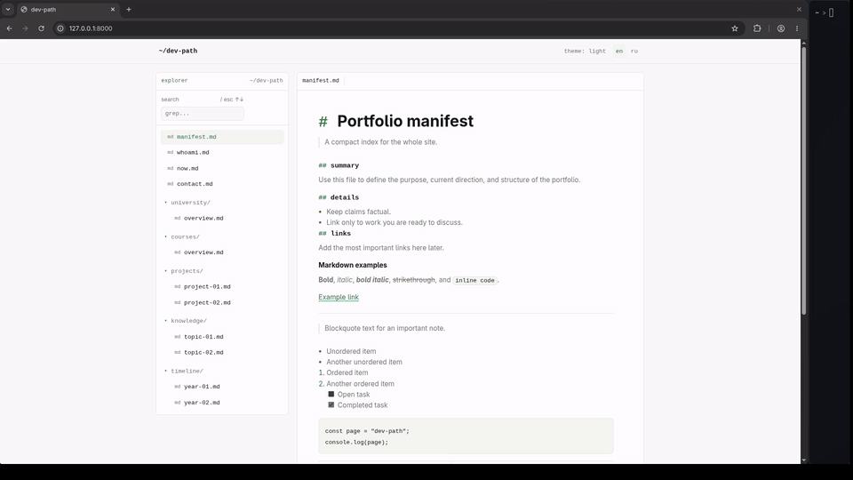
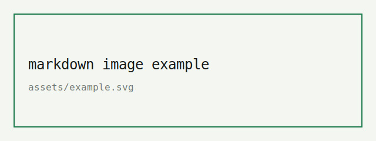

# dev-path

A minimal portfolio website styled as a small developer filesystem.



The site reads content from Markdown files, builds a file tree automatically, 
supports English and Russian content, search, dark mode, collapsible folders, 
keyboard navigation, and GitHub Pages hosting.

## Features

- Content is edited in Markdown, not in HTML.
- English content lives in `README.en.md`.
- Russian content lives in `README.ru.md`.
- You can add any new language file.
- New pages and folders are created automatically from Markdown headings.
- File tree search works across the selected language.
- Folders can be collapsed and expanded.
- Light and dark themes are supported.
- Language and theme choices are saved in `localStorage`.
- The site is fully static and works on GitHub Pages.

## Project Structure

```text
.
├── index.html
├── styles.css
├── script.js
├── README.en.md
├── README.ru.md
├── README.md
├── assets/
│   └── example.svg
└── .gitignore
```

## Local Setup

No build step is required.
Run a local static server from the project root:

```bash
python3 -m http.server 8000
```

Open:

```text
http://127.0.0.1:8000/
```

Do not open `index.html` directly from the filesystem if you want Markdown loading to work reliably. 
The site uses `fetch()` to read `README.en.md` and `README.ru.md`, so it should be served over HTTP.

## Editing Content

Edit content:

```text
README.en.md
and any other README.[language].md file.
```

Each website page starts with a second-level Markdown heading that ends with `.md`:
```md
## projects/my-project.md

# My Project

> Short intro.

## summary

Main text.
```

This automatically creates:

```text
projects/
  my-project.md
```

A page without a folder appears in the root:

```md
## contact.md

# Contact
```

## Adding a New Folder

Add a page path with a folder prefix:

```md
## experiments/test-01.md

# Test 01

> Short note.
```

The site will create:

```text
experiments/
  test-01.md
```

For another language version, add the matching page to `README.[language].md`:

```md
## experiments/test-01.md

# Test 01

> Short note in your language.
```

Pages do not have to use the same path in both languages, but keeping the structure similar makes the site easier to maintain.

## Supported Markdown

The built-in renderer supports common Markdown features:

```md
# Heading 1
## Heading 2
### Heading 3
```

```md
**bold**
*italic*
***bold italic***
~~strikethrough~~
`inline code`
```

```md
[Link](https://example.com)

```

````md
```js
const page = "dev-path";
console.log(page);
```
````

```md
- Unordered item
- Another item

1. Ordered item
2. Another ordered item

- [ ] Open task
- [x] Completed task
```

```md
| Column | Value |
| --- | --- |
| status | draft |
```

```md
> Blockquote

---
```

## Images and Assets

Place images or other static files in `assets/`.

Example:

```text
assets/profile.png
```

Then reference it from Markdown:

```md

```

## Site Settings

Most visual settings are in `styles.css`.

Useful CSS variables:

```css
--bg
--panel
--text
--muted
--line
--soft
--accent
```

Dark theme values are defined under:

```css
[data-theme="dark"]
```

UI labels, language files, theme behavior, search, folder rendering, and Markdown parsing are handled in `script.js`.

## Keyboard Shortcuts

```text
/      focus search
Esc    clear search and blur
↑      previous visible file
↓      next visible file
Enter  open first search result
```

## GitHub Pages Deployment

1. Create a GitHub repository.
2. Push these files to the repository.
3. Open repository settings.
4. Go to `Settings -> Pages`.
5. Select deployment from the `main` branch and the repository root.
6. Save.

GitHub Pages will serve the static files directly. No framework or build command is needed.

## Using as a Template

This project works well as a public template repository.

Recommended setup:

1. Keep this repository generic with placeholder content.
2. Create a separate personal site repository for your own content.
3. Edit only `README.en.md`, `README.ru.md`, and assets in the personal repository.

This keeps the template reusable while your personal information stays separate from the public starter.

## Notes

- If a page is added only to `README.en.md`, it appears only in English mode.
- If a page is added only to `README.ru.md`, it appears only in Russian mode.
- Folder collapse state, selected language, and selected theme are stored in the browser.
- The site is static; there is no backend, database, or build process.
